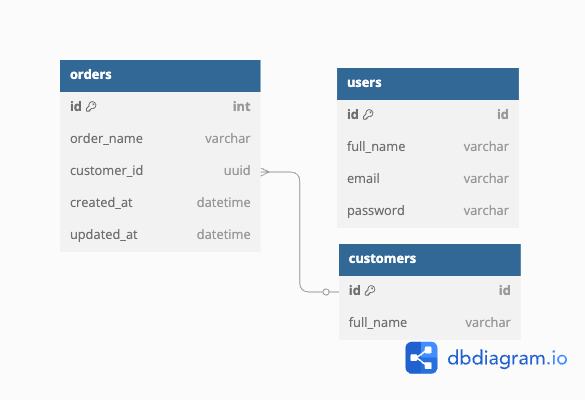

# 📟 DBO Backend API

RESTful API berbasis Golang (Gin-Gonic) untuk manajemen **Customer**, **Order**, dan **Authentication**, lengkap dengan JWT Auth, Dockerized setup, dan dokumentasi API.

---

## 🚀 Fitur

* **Customer Module**: List (paginate)(sudah include search), Detail, Create, Update, Delete
* **Order Module**: List (paginate)(sudah include search), Detail, Create, Update, Delete
* **Auth Module**: Login (Insert & Validate Login Data)

---

## 💠 Teknologi

* Golang + Gin-Gonic
* PostgreSQL / MySQL
* JWT Token untuk autentikasi
* Docker & Docker Compose

---

## 🧱 Struktur Proyek (MVC)

```
internal/
├── module/
│   ├── auth/
│   ├── customer/
│   └── order/
├── model/
├── repository/
```

---

## 🖼️ ERD



---

## 📚 Dokumentasi API

Tersedia via Postman Collection
🔗 DBO.postman_collection.json

---

## ▶️ Cara Menjalankan

```bash
docker-compose up -d
```

API default di: `http://localhost:4000`

---